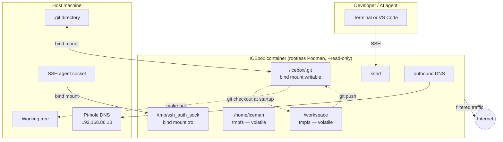

# ICEbox — Secure Ephemeral Development Environment

ICEbox gives you a throwaway coding sandbox that's isolated from your host machine. Spin one up for any git project, do your work (or let an AI agent do its worst), then tear it down. Only code you explicitly `git commit && git push` escapes the container. Everything else — downloaded tools, modified configs, rogue files — vanishes on exit.

It is a defence against the **Trifecta of Doom**: tool-enabled AI agents + access to secrets + unrestricted network.

```
┌─────────────────────────────────────────────────┐
│  ICEbox container (rootless Podman)              │
│                                                  │
│  /workspace  ←──── git checkout (auto)          │
│    (tmpfs)   ────── git push  ──────────►        │
│                                          host    │
│  /home/iceman                           .git     │
│    (tmpfs)      only commits escape ──► WT sync  │
│                                                  │
│  SSH in ──► sshd           DNS ──► Pi-hole       │
│  agent forwarded           internet: allowed     │
└─────────────────────────────────────────────────┘
```

## Architecture



## Security model

| Threat | Mitigation |
|---|---|
| Agent writes malicious files | `/workspace` and `/home/iceman` are `tmpfs` — gone on container exit |
| Agent exfiltrates secrets via network | DNS routed through Pi-hole filtered group; internet access only |
| Agent persists code changes | Only `git push` can write to the host; user must run `make pull` to accept |
| Container escalates privileges | `--cap-drop=ALL`, `no-new-privileges`, rootless Podman, read-only root FS |
| Agent accesses host SSH private keys | SSH agent forwarded by socket (agent pinned to keys; private key bytes never enter container) |

## Quick start

### One-time setup

```bash
git clone <this-repo> ~/icebox
cd ~/icebox && make build          # builds localhost/icebox:latest
```

Optional shell alias for convenience:

```bash
echo "alias icebox='make -f ~/icebox/Icebox.mk'" >> ~/.bashrc
```

### Per-project usage

```bash
cd ~/my-project                    # must be a git repo
make -f ~/icebox/Icebox.mk         # start icebox (default target)
```

SSH in using the config snippet printed at startup, or connect VS Code via Remote-SSH.

When you're done:

```bash
make -f ~/icebox/Icebox.mk down    # stop container (data gone)
```

### Getting changes back to the host

Inside the container:

```bash
git add . && git commit -m "my work"
git push origin HEAD:main
```

On the host:

```bash
make -f ~/icebox/Icebox.mk pull    # syncs working tree to latest commit
```

## Make targets

| Target | Description |
|---|---|
| `make` / `make icebox` | Build image, start container, print SSH config |
| `make build` | (Re)build the container image |
| `make down` | Stop the container |
| `make clean` | Stop container + delete all host cache artifacts |
| `make pull` | Sync host working tree after a container push |
| `make ssh-config` | Re-print SSH config for a running container |
| `make help` | List all targets |

## Operational modes

```bash
make icebox MODE=standard       # default: tmpfs workspace, disk-backed .cache
make icebox MODE=zero_leakage   # everything in memory, zero disk writes
make icebox MODE=resource_saver # everything disk-backed, minimal RAM use
```

See [USER_GUIDE.md](USER_GUIDE.md) for full details.

## Prerequisites

- **podman** ≥ 4.0 (rootless, with `newuidmap`/`newgidmap`)
- **git** ≥ 2.28
- An SSH key pair at `~/.ssh/id_*.pub` (or set `SSH_KEY_PATH`)
- Pi-hole DNS at `192.168.86.10` (or override with `ICEBOX_DNS=<ip>`)
