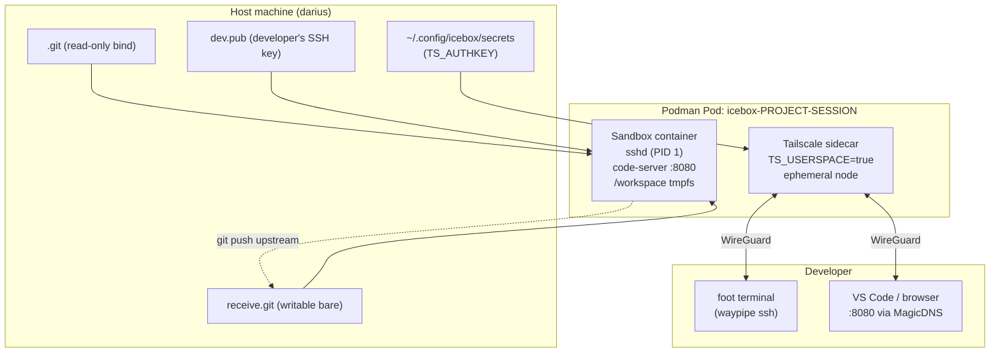

# ICEbox — Secure Ephemeral Development Environment

ICEbox gives you a throwaway coding sandbox that's isolated from your host machine. Spin one up for any git project, do your work (or let an AI agent do its worst), then tear it down. Only code you explicitly push escapes the container. Everything else — downloaded tools, modified configs, rogue files — vanishes on exit.

It is a defence against the **Trifecta of Doom**: tool-enabled AI agents + access to secrets + unrestricted network.

```
┌─────────────────────────────────────────────────────────────────┐
│  Podman Pod: icebox-<project>-<session>   (shared net ns)        │
│                                                                  │
│  ┌─────────────────────┐   ┌──────────────────────────────────┐ │
│  │ tailscale sidecar   │   │ sandbox container (read-only FS) │ │
│  │  TS_USERSPACE=true  │   │  sshd (PID 1)                    │ │
│  │  ephemeral authkey  │   │  code-server :8080               │ │
│  │  icebox-<session>   │   │  /workspace (tmpfs)              │ │
│  └─────────────────────┘   │  /home/dev  (tmpfs)              │ │
│                             └──────────────────────────────────┘ │
│  Network: --network=pasta (host/LAN unreachable from container)  │
└─────────────────────────────────────────────────────────────────┘
          ▲
          │  Tailscale WireGuard tunnel (no inbound host ports)
          │
    Developer laptop  ──►  waypipe ssh ──►  foot terminal
                      ──►  http://icebox-<session>.<tailnet>:8080
```

## Architecture



## Security model

| Threat | Mitigation |
|---|---|
| Agent writes malicious files | `/workspace` and `/home/dev` are `tmpfs` — gone on pod exit |
| Agent exfiltrates via network | `--network=pasta`: host and LAN unreachable; egress via host NAT only |
| Agent persists code without review | Pushes go to `receive.git`; developer runs `make merge` to accept |
| Container escalates privileges | `--cap-drop=ALL`, `no-new-privileges`, `--read-only`, `--pids-limit=256`, `--userns=auto` |
| Agent accesses host SSH private keys | Only dev's public key enters pod; private keys never leave host |
| Container scanned from internet | Zero inbound ports on host; Tailscale is the only ingress path |
| Session persists after exit | Ephemeral authkey auto-purges node from Tailnet on pod removal |
| Process-level filesystem abuse | `icebox-run` applies Landlock ABI v4 per-process FS + TCP restrictions |

## Quick start

### One-time setup

```bash
# 1. Clone the icebox repo
git clone <icebox-repo> ~/icebox

# 2. Get a Tailscale ephemeral auth key
#    https://login.tailscale.com/admin/settings/keys
#    (Reusable: no, Ephemeral: yes)
echo 'TS_AUTHKEY=tskey-auth-...' >> ~/.config/icebox/secrets
chmod 600 ~/.config/icebox/secrets

# 3. Install host prerequisites
sudo apt install waypipe foot    # Wayland compositor required for waypipe
```

### Per-project usage

```bash
cd ~/my-project                          # must be a git repo

# Copy the example config and edit as needed
cp ~/icebox/icebox-config.yaml .

# Start the session — builds image if needed, opens a foot terminal
make -f ~/icebox/Icebox.mk auth
```

`make auth` will:
1. Build (or reuse) the container image
2. Generate a session keypair and stage your SSH public key
3. Create the Podman pod (Tailscale sidecar + sandbox)
4. Wait for Tailscale to connect and register `icebox-<session>` on your Tailnet
5. Wait for sshd to be ready inside the sandbox
6. Print the code-server URL: `http://icebox-<session>.<tailnet>:8080`
7. Open a `foot` terminal via `waypipe ssh` — this blocks until you close the terminal

To re-attach after detaching:

```bash
make -f ~/icebox/Icebox.mk connect
```

When you're done:

```bash
make -f ~/icebox/Icebox.mk down    # stop pod, purge Tailscale node, delete session key
```

### Getting agent changes back to the host

Inside the container, the agent pushes branches to the `upstream` remote (backed by `receive.git` on the host):

```bash
# Inside foot terminal / code-server terminal
git checkout -b agent/my-feature
git add . && git commit -m "implement feature"
git push upstream agent/my-feature
```

On the host, review and merge:

```bash
make -f ~/icebox/Icebox.mk pr-list            # list branches agent pushed
make -f ~/icebox/Icebox.mk merge BRANCH=agent/my-feature
git log --oneline -5                          # verify the merge
git push origin HEAD                          # push to upstream if satisfied
```

## Make targets

| Target | Description |
|---|---|
| `make auth` | Build image if needed, start pod, open waypipe terminal |
| `make connect` | Re-attach waypipe terminal to a running pod |
| `make status` | List running ICEbox pods and MagicDNS URLs |
| `make down` | Stop pod, delete session key, purge Tailscale node |
| `make clean` | `down` + delete all host artifacts for this project |
| `make build` | Force-rebuild the container image |
| `make pr-list` | List branches agent has pushed to receive.git |
| `make merge BRANCH=<b>` | Fetch and merge an agent branch into host working tree |
| `make help` | List all targets |

## Prerequisites

**Host machine:**

| Dependency | Notes |
|---|---|
| `podman` ≥ 4.0 | Rootless; `newuidmap`/`newgidmap` must be installed |
| `git` ≥ 2.28 | |
| `waypipe` | Wayland display forwarder; `sudo apt install waypipe` |
| `foot` | Wayland terminal; `sudo apt install foot` |
| Wayland compositor | Required for `waypipe`; works with GNOME/KDE/Sway/etc. |
| Tailscale auth key | Ephemeral key from [admin console](https://login.tailscale.com/admin/settings/keys) |
| SSH key pair | `~/.ssh/id_*.pub` auto-detected, or set `SSH_KEY_PATH` |

**Per-project:**

- `icebox-config.yaml` in the project root (copy from the icebox repo)

### Agent sandboxing with `icebox-run`

Inside the container, agents can run commands under an additional Landlock layer:

```bash
icebox-run <cmd> [args...]
```

`icebox-run` applies Landlock ABI v4 restrictions before exec'ing the command:

- **Filesystem**: full read/write access only in `/workspace` and `/tmp`; read-only access to `/usr`, `/lib`, `/proc`, `/dev` (for binaries and dynamic linking); all other paths — including `/etc`, `/home`, and `/icebox` secrets — are denied
- **Network**: TCP outbound connections restricted to ports listed in `egress.ports` in `icebox-config.yaml`; an empty list blocks all outbound TCP

**Known limitations of `icebox-run`:**
- `/etc` is excluded — programs needing DNS (`/etc/resolv.conf`), TLS (`/etc/ssl/certs`), or user lookups will fail. Use `icebox-run` for local file processing, not commands that need name resolution.
- UDP is not restricted — Landlock ABI v4 covers TCP connect only.
- Minimum kernel 6.10 required for network restrictions; older kernels fall back to unrestricted with a warning.

Example — inside the `foot` terminal:
```bash
icebox-run python3 build.py        # build script with restricted FS + net
icebox-run cat /etc/passwd         # denied — /etc not in allowed paths
```

Configure allowed ports in `icebox-config.yaml`:
```yaml
egress:
  ports:
    - 443   # HTTPS (npm install, pip install, etc.)
```

### Optional: gVisor runtime (`runsc`)

gVisor is a sandboxed container runtime that intercepts syscalls for deeper isolation. To use it with ICEbox:

1. **Install gVisor on darius:**

   ```bash
   curl -fsSL https://gvisor.dev/archive.key | sudo gpg --dearmor -o /usr/share/keyrings/gvisor-archive-keyring.gpg
   echo "deb [arch=$(dpkg --print-architecture) signed-by=/usr/share/keyrings/gvisor-archive-keyring.gpg] https://storage.googleapis.com/gvisor/releases release main" | sudo tee /etc/apt/sources.list.d/gvisor.list
   sudo apt update && sudo apt install runsc
   ```

2. **Register `runsc` with Podman:**

   ```bash
   # /etc/containers/containers.conf (or ~/.config/containers/containers.conf for rootless)
   [engine.runtimes]
   runsc = ["/usr/bin/runsc", "--ignore-cgroups"]
   ```

3. **Launch ICEbox with gVisor:**

   ```bash
   ICEBOX_RUNTIME=runsc make -f ~/icebox/Icebox.mk auth
   ```

   The default runtime is `runc`. The `ICEBOX_RUNTIME` variable is passed to `podman pod create --runtime`.

## Documentation

| Document | Description |
|---|---|
| [USER_GUIDE.md](USER_GUIDE.md) | Full operational guide — workflow, config reference, troubleshooting |
| [REQUIREMENTS.md](REQUIREMENTS.md) | Product requirements and problem statement |
| [STATUS.md](STATUS.md) | Sprint completion status and backlog |
| [docs/ICEBox2.md](docs/ICEBox2.md) | Architecture spec (Tailscale ephemeral sidecar design) |
| [task.md](task.md) | Sprint task board |
