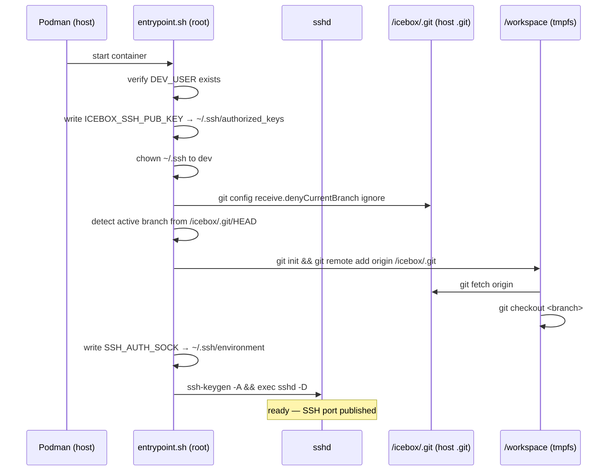
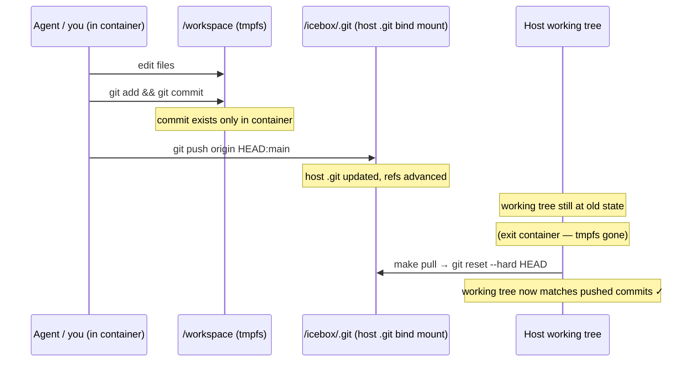
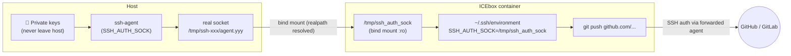
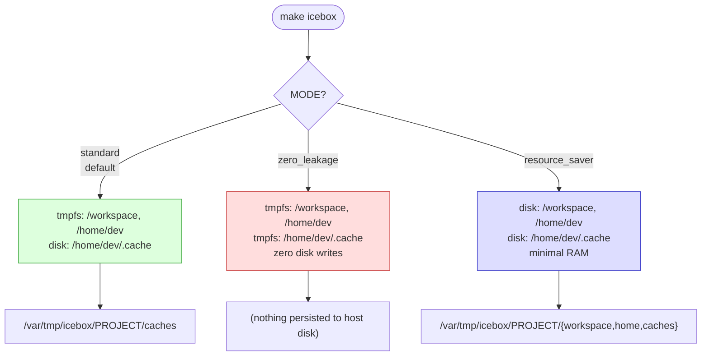
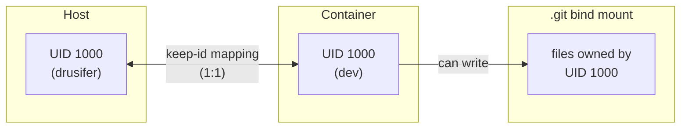

# ICEbox User Guide

This guide covers everything from first-time setup to day-to-day workflows, security model details, and troubleshooting.

---

## Table of contents

1. [How it works](#how-it-works)
2. [Prerequisites](#prerequisites)
3. [One-time setup](#one-time-setup)
4. [Starting a session](#starting-a-session)
5. [Working inside the container](#working-inside-the-container)
6. [Getting changes out — the git workflow](#getting-changes-out--the-git-workflow)
7. [SSH agent forwarding](#ssh-agent-forwarding)
8. [Operational modes](#operational-modes)
9. [Configuration reference](#configuration-reference)
10. [Security model in depth](#security-model-in-depth)
11. [Troubleshooting](#troubleshooting)

---

## How it works

ICEbox starts a rootless Podman container with a **read-only root filesystem**. Your project's source code is _not_ bind-mounted directly — instead, only the `.git` directory is mounted. On startup, the entrypoint checks out your active branch into an in-memory `tmpfs` at `/workspace`.

The result: the container sees your code, but any changes it makes to the filesystem disappear when the container stops. The _only_ channel through which data escapes is a `git push`, which you control from the host via `make pull`.

### Container startup sequence



---

## Prerequisites

| Dependency | Minimum version | Notes |
|---|---|---|
| `podman` | 4.0 | Rootless; `newuidmap`/`newgidmap` must be installed |
| `git` | 2.28 | Needed for `--initial-branch` / `rev-parse` |
| SSH key pair | — | `~/.ssh/id_*.pub` auto-detected, or set `SSH_KEY_PATH` |
| Pi-hole DNS | — | Default `192.168.86.10`; override with `ICEBOX_DNS` |

Check rootless Podman is working:

```bash
podman run --rm hello-world
```

If that fails, ensure `/etc/subuid` and `/etc/subgid` have entries for your user and run `podman system migrate`.

---

## One-time setup

```bash
# 1. Clone the icebox repo somewhere permanent
git clone <icebox-repo> ~/icebox

# 2. (Optional) shell alias for convenience
echo "alias icebox='make -f ~/icebox/Icebox.mk'" >> ~/.bashrc
source ~/.bashrc
```

The image (`localhost/icebox:latest`) is built automatically on the first `icebox` run and rebuilt whenever `Dockerfile` or `entrypoint.sh` change. No registry is used; the image never leaves your machine. Run `make build` from the icebox repo at any time to force a rebuild.

### Icebox repo layout

```
~/icebox/
├── Icebox.mk         ← the distributable Makefile (invoke this from any project)
├── Makefile          ← thin wrapper (include Icebox.mk) for development in this repo
├── Dockerfile        ← image definition
└── entrypoint.sh     ← baked into the image at build time
```

`Icebox.mk` uses `$(lastword $(MAKEFILE_LIST))` to locate itself at runtime, so it works correctly regardless of where you invoke `make -f`.

---

## Starting a session

Navigate to any git project and invoke `Icebox.mk`:

```bash
cd ~/my-project
make -f ~/icebox/Icebox.mk          # or just: icebox
```

ICEbox will:
1. Build (or reuse) the image
2. Remove any previous container for this project
3. Start a fresh container
4. Wait for sshd to become ready
5. Print an SSH config snippet

```
==> Container started.

Add the following to your ~/.ssh/config:
-------------------------------------------------
Host icebox-my-project
  HostName localhost
  User dev
  Port 45231
  IdentityFile /home/you/.ssh/id_ed25519
-------------------------------------------------
```

Add that block to `~/.ssh/config` once. After that:

```bash
ssh icebox-my-project              # terminal access
code --remote ssh-remote+icebox-my-project /workspace   # VS Code
```

The container name is always `icebox-<project-directory-name>`, so each project gets its own isolated instance.

---

## Working inside the container

Your project's current branch is checked out at `/workspace` and your shell starts there. The environment is a standard Debian Trixie userland.

### What persists between restarts

This depends on the [operational mode](#operational-modes). In the default `standard` mode:

| Location | Backed by | Survives restart? |
|---|---|---|
| `/workspace` | tmpfs | No |
| `/home/dev` | tmpfs | No |
| `/home/dev/.cache` | host disk (`/var/tmp/icebox/<project>/caches`) | Yes |
| `/icebox/.git` | host `.git` bind mount | Yes (it's your real git history) |

### Installed tools

The base image (`debian:trixie-slim`) includes git, curl, sudo, and openssh. A non-root user `dev` (UID 1000) with passwordless sudo is created at build time. Install additional tools with `apt` or language-specific package managers; they'll be gone on restart (by design).

---

## Getting changes out — the git workflow

This is the heart of ICEbox's security model. The workspace is volatile, but git commits pushed to the host's `.git` are permanent.



### Why not mount the working tree directly?

Mounting the full project directory (Option B) means any file the agent writes — committed or not — immediately lands on your host. With ICEbox's approach (Option A), only code the agent explicitly commits and pushes can reach your host. You review `git log` before running `make pull`.

| Scenario | ICEbox (bind .git only) | Direct bind mount |
|---|---|---|
| Agent writes `.bashrc` payload | Stays in tmpfs, gone on exit | On your host immediately |
| Agent downloads a binary | Stays in tmpfs, gone on exit | On your host immediately |
| Agent encrypts workspace (ransomware) | tmpfs gone on exit | Your files encrypted |
| Agent commits and pushes | You see it in `git log` before pulling | Already on host |

### Step-by-step

Inside the container:

```bash
cd /workspace
git add my-changes.py
git commit -m "implement feature X"
git push origin HEAD:main
```

On the host — after you've reviewed `git log`:

```bash
make -f ~/icebox/Icebox.mk pull
```

`make pull` runs `git reset --hard HEAD`, refusing to proceed if you have unstaged edits in the host working tree.

---

## SSH agent forwarding

ICEbox forwards your host SSH agent into the container so you can push to remote repositories (GitHub, GitLab, etc.) without storing private keys inside the container.



The socket path is resolved with `realpath` before mounting — this handles the common case where `SSH_AUTH_SOCK` is a symlink (e.g., systemd user socket or gpg-agent).

The agent is exposed to **all SSH session types** (interactive, `bash -s`, VS Code remote) via `~/.ssh/environment` and `PermitUserEnvironment yes` in sshd.

If `SSH_AUTH_SOCK` is not set when you run `make icebox`, agent forwarding is disabled and a warning is printed.

---

## Operational modes



| | standard | zero_leakage | resource_saver |
|---|---|---|---|
| `/workspace` | tmpfs | tmpfs | host disk |
| `/home/dev` | tmpfs | tmpfs | host disk |
| `/home/dev/.cache` | host disk | tmpfs | host disk |
| Host disk writes | Cache only | None | All |
| RAM usage | Medium | High | Low |
| Best for | Daily use | Untrusted code | Low-RAM devices |

```bash
make icebox                          # standard (default)
make icebox MODE=zero_leakage        # maximum isolation
make icebox MODE=resource_saver      # Raspberry Pi / low RAM
```

Host disk state for `standard` and `resource_saver` modes lives at `/var/tmp/icebox/<project>/`. Run `make clean` to delete it.

---

## Configuration reference

All variables can be set on the command line: `make icebox VAR=value`

| Variable | Default | Description |
|---|---|---|
| `MODE` | `standard` | Operational mode: `standard`, `zero_leakage`, `resource_saver` |
| `SSH_KEY_PATH` | first `~/.ssh/id_*.pub` | Path to SSH public key to inject |
| `DEV_USER` | `dev` | Username inside the container |
| `IMAGE_NAME` | `localhost/icebox:latest` | Container image to run |
| `ICEBOX_DNS` | `192.168.86.10` | DNS server (Pi-hole filtered group) |
| `ICEBOX_ENV_VARS` | _(empty)_ | Extra `-e KEY=val` flags passed to `podman run` |
| `SSH_AUTH_SOCK` | _(from environment)_ | SSH agent socket; forwarded automatically if set |

### Passing secrets to the container

Use `ICEBOX_ENV_VARS` to inject API keys without storing them in files:

```bash
make icebox ICEBOX_ENV_VARS="-e ANTHROPIC_API_KEY=sk-ant-... -e GITHUB_TOKEN=ghp_..."
```

Inside the container these appear as normal environment variables.

---

## Security model in depth

### Capability set

The container starts with all capabilities dropped and adds back only what sshd requires:

| Capability | Reason |
|---|---|
| `CHOWN` | sshd / entrypoint fix ownership of `.ssh` |
| `DAC_OVERRIDE` | read files regardless of permission bits |
| `FOWNER` | `chmod` on files owned by others |
| `NET_BIND_SERVICE` | bind port 22 |
| `SYS_CHROOT` | sshd privilege separation |
| `SETUID` / `SETGID` | drop to `dev` user |

`CAP_NET_ADMIN` is intentionally absent — a compromised agent with container root cannot modify network rules, routing tables, or firewall policies.

### UID mapping with `--userns=keep-id`



Without `--userns=keep-id`, container UID 1000 maps to a subordinate UID on the host, making the `.git` bind mount read-only. The `keep-id` flag maps host UID to container UID 1:1, enabling git push from inside the container.

### DNS and network filtering

All container DNS queries go to `192.168.86.10` (Pi-hole). Podman containers appear as `10.88.x.x` source addresses on the host (via the no-masquerade iptables RETURN rule in `roles/pihole-routing/`), which causes Pi-hole to assign them to a heavily filtered client group — separate from LAN devices.

This means an agent that tries to contact known-malicious domains or ad/tracker infrastructure is blocked at the DNS level by Pi-hole, without any in-container configuration the agent could modify.

---

## Troubleshooting

### Container fails to start

```bash
podman logs icebox-<project>
```

Common causes:
- `ICEBOX_SSH_PUB_KEY` not set (SSH key file missing)
- `.git` directory not found at `$(CURDIR)/.git` — run icebox from a git repo root
- Port conflict — an old container with the same name is still running; `make clean` clears it

### SSH connection refused

The health check polls for 10 seconds. If it times out, check `podman logs`. If sshd is running but connections fail, ensure your `~/.ssh/config` entry matches the port printed by `make icebox`:

```bash
make -f ~/icebox/Icebox.mk ssh-config   # re-print current port
```

### git push rejected

If `git push origin HEAD:main` fails from inside the container:

```bash
# Verify the remote is reachable
git remote -v

# Check host .git/config
GIT_DIR=/icebox/.git git config receive.denyCurrentBranch
# should print: ignore
```

If the receive config is missing, restart the container (the entrypoint sets it on each startup).

### make pull blocked: "Host has modified or staged changes"

ICEbox refuses to reset the host working tree if you have uncommitted work. Commit or stash first:

```bash
git stash       # save work temporarily
make pull       # sync from container commit
git stash pop   # restore your work
```

### SSH agent not available inside container

Check that `SSH_AUTH_SOCK` was set when the container was started:

```bash
# From inside the container
cat ~/.ssh/environment           # should show SSH_AUTH_SOCK=...
ls -la /tmp/ssh_auth_sock        # should be a socket

# If missing, restart with agent running on host:
eval $(ssh-agent)
ssh-add ~/.ssh/id_ed25519
make icebox
```
