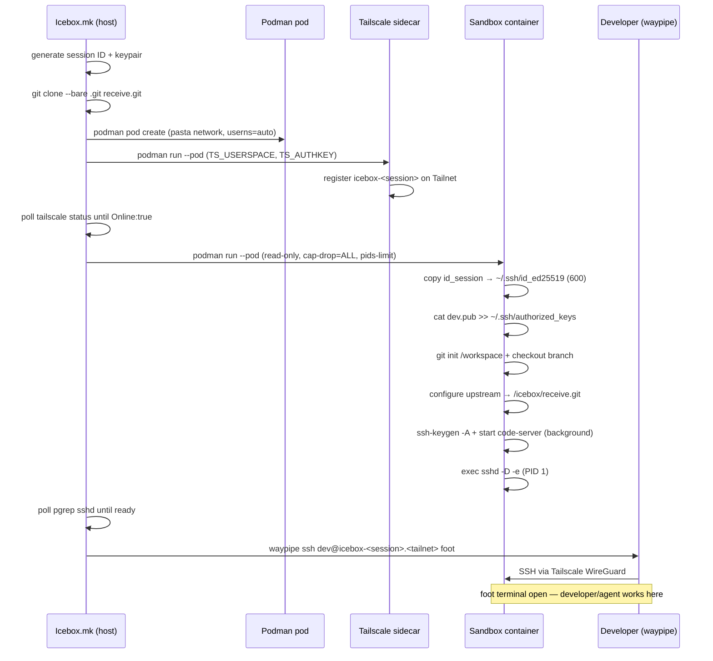

# ICEbox User Guide

This guide covers everything from first-time setup to day-to-day workflows, security model details, and troubleshooting.

---

## Table of contents

1. [How it works](#how-it-works)
2. [Prerequisites](#prerequisites)
3. [One-time setup](#one-time-setup)
4. [Starting a session](#starting-a-session)
5. [Working inside the container](#working-inside-the-container)
6. [Agent PR workflow](#agent-pr-workflow)
7. [Sandboxing commands with icebox-run](#sandboxing-commands-with-icebox-run)
8. [icebox-config.yaml reference](#icebox-configyaml-reference)
9. [Security model in depth](#security-model-in-depth)
10. [Troubleshooting](#troubleshooting)

---

## How it works

ICEbox starts a rootless Podman **pod** containing two containers in a shared network namespace:

1. **Tailscale sidecar** — registers an ephemeral node (`icebox-<session>`) on your Tailnet. Provides encrypted ingress without any inbound ports on the host.
2. **Sandbox container** — runs `sshd` as PID 1 and `code-server` in the background. Your project's `.git` is mounted read-only; a writable `receive.git` is mounted for agent pushes.

The developer connects via `waypipe ssh` (Wayland display forwarding over SSH) to get a `foot` terminal. code-server is accessible at `http://icebox-<session>.<tailnet>:8080` from any device on the Tailnet.

On teardown, the pod is destroyed, the Tailscale ephemeral node is purged automatically, and the session keypair is deleted. Nothing persists.

### Container startup sequence



---

## Prerequisites

| Dependency | Notes |
|---|---|
| `podman` ≥ 4.0 | Rootless; `newuidmap`/`newgidmap` must be installed |
| `git` ≥ 2.28 | |
| `waypipe` | `sudo apt install waypipe` — Wayland display forwarder |
| `foot` | `sudo apt install foot` — Wayland terminal emulator |
| Wayland compositor | Required for `waypipe`; GNOME/KDE/Sway/etc. all work |
| Tailscale | Installed and authenticated on the host |
| Tailscale ephemeral auth key | From [admin console](https://login.tailscale.com/admin/settings/keys): Reusable: no, Ephemeral: yes |
| SSH key pair | `~/.ssh/id_*.pub` auto-detected, or set `SSH_KEY_PATH` |

Check rootless Podman is working:

```bash
podman run --rm hello-world
```

If that fails, ensure `/etc/subuid` and `/etc/subgid` have entries for your user and run `podman system migrate`.

---

## One-time setup

```bash
# 1. Clone the icebox repo
git clone <icebox-repo> ~/icebox

# 2. Store your Tailscale ephemeral auth key
mkdir -p ~/.config/icebox
echo 'TS_AUTHKEY=tskey-auth-...' > ~/.config/icebox/secrets
chmod 600 ~/.config/icebox/secrets

# 3. Optional: shell alias
echo "alias icebox='make -f ~/icebox/Icebox.mk'" >> ~/.bashrc
source ~/.bashrc
```

The container image (`localhost/trixie-icebox:latest`) is built automatically on the first `make auth` run and rebuilt whenever `Dockerfile`, `entrypoint.sh`, `sshd_config`, or `icebox-run.c` change. Run `make build` at any time to force a rebuild.

---

## Starting a session

Navigate to any git project, add an `icebox-config.yaml`, and run `make auth`:

```bash
cd ~/my-project                                       # must be a git repo
cp ~/icebox/icebox-config.yaml .                     # copy example config
make -f ~/icebox/Icebox.mk auth
```

`make auth` will:

1. Validate `icebox-config.yaml` exists and is parseable
2. Check `TS_AUTHKEY` is set (env var or `~/.config/icebox/secrets`)
3. Build (or reuse) the container image
4. Generate an ephemeral session keypair at `/var/tmp/icebox/<project>/id_session`
5. Stage your SSH public key as `dev.pub`
6. Clone your `.git` to `receive.git` (agent push target)
7. Create the Podman pod with Tailscale sidecar
8. Wait for Tailscale to connect (polls up to 30s)
9. Start the sandbox container
10. Wait for `sshd` to be ready (polls up to 30s)
11. Print the code-server URL
12. Open a `foot` terminal via `waypipe ssh` — blocks until you close the terminal

```
==> Tailscale connected.
==> sshd ready.

==> ICEbox ready.
    code-server: http://icebox-a3f291.my-tailnet.ts.net:8080
    make -f /home/you/icebox/Icebox.mk down   # stop and clean up

==> Opening terminal (waypipe ssh)...
```

### Reconnecting after detach

If you close the terminal but want to reconnect without stopping the pod:

```bash
make -f ~/icebox/Icebox.mk connect
```

### Checking running pods

```bash
make -f ~/icebox/Icebox.mk status
```

### Stopping a session

```bash
make -f ~/icebox/Icebox.mk down     # stop pod + delete session key + purge Tailscale node
make -f ~/icebox/Icebox.mk clean    # down + delete all host artifacts (receive.git, session dir)
```

---

## Working inside the container

Your project's current branch is checked out at `/workspace` and your shell starts there. The environment is a Debian Trixie userland with git, Node.js, Python 3, Clang/LLVM, Go, code-server, and AI agent CLIs (`claude`, `gemini`) pre-installed.

### What persists and what doesn't

| Location | Backed by | Survives pod restart? |
|---|---|---|
| `/workspace` | tmpfs | No |
| `/home/dev` | tmpfs | No |
| `/icebox/.git` | host `.git` bind mount (read-only) | Yes — it's your real git history |
| `/icebox/receive.git` | host `receive.git` bind mount (writable) | Yes — until `make down` |

**Nothing inside the container writes to the host filesystem directly.** The only paths out are:
- `git push upstream <branch>` → writes to `receive.git` on the host
- The host developer runs `make merge` to pull agent work into the host working tree

### Key paths inside the container

| Path | Purpose |
|---|---|
| `/workspace` | Your project checkout (tmpfs) |
| `/icebox/.git` | Host `.git` read-only bind mount (origin remote) |
| `/icebox/receive.git` | Host bare clone (upstream remote — agent pushes here) |
| `/icebox/id_session` | Session keypair (read-only staging mount) |
| `/icebox/config.yaml` | `icebox-config.yaml` from host (read-only) |
| `/icebox/repos/<name>` | Extra repos from config (read-only bare clones) |

---

## Agent PR workflow

ICEbox uses a two-level git model to protect the host working tree from agent writes:

```
host .git (read-only)  ←  agent reads, cannot push here
host receive.git (rw)  ←  agent pushes branches here
host working tree      ←  developer merges reviewed branches via make merge
```

### Inside the container (agent side)

```bash
# The workspace is already on the correct branch
cd /workspace

# Make changes, then push to the upstream remote
git checkout -b agent/my-feature
git add .
git commit -m "implement feature X"
git push upstream agent/my-feature
```

### On the host (developer side)

```bash
# See what branches the agent has pushed
make -f ~/icebox/Icebox.mk pr-list

# Review the diff before merging
git -C /var/tmp/icebox/<project>/receive.git log agent/my-feature --oneline

# Fetch and merge with --no-ff (preserves merge commit for auditability)
make -f ~/icebox/Icebox.mk merge BRANCH=agent/my-feature

# Push to upstream if satisfied
git push origin HEAD
```

`make merge` fetches the branch from `receive.git` and runs `git merge --no-ff` on the host. It does not automatically push.

---

## Sandboxing commands with icebox-run

`icebox-run` is a Landlock ABI v4 sandbox wrapper compiled into the image. Use it to restrict what a specific command can access on the filesystem and network.

```bash
icebox-run <cmd> [args...]
```

### What it restricts

| Resource | Rule |
|---|---|
| `/workspace`, `/tmp` | Full read/write |
| `/usr`, `/lib`, `/proc`, `/dev` | Read-only (needed for dynamic linking and binaries) |
| All other paths (`/etc`, `/home`, `/icebox`, …) | Denied |
| TCP outbound | Only ports listed in `egress.ports` in `icebox-config.yaml` |
| UDP | Unrestricted (Landlock ABI v4 limitation) |

### Configuration

Add allowed TCP egress ports to your project's `icebox-config.yaml`:

```yaml
egress:
  ports:
    - 443   # HTTPS
    - 80    # HTTP
```

An empty `ports` list denies all outbound TCP connections from the wrapped process.

### Known limitations

- **`/etc` is excluded** — programs that need DNS resolution (`/etc/resolv.conf`), TLS certificate verification (`/etc/ssl/certs`), or user database lookups (`/etc/passwd`) will fail. Use `icebox-run` for local file processing, not commands that perform name resolution.
- **UDP is not restricted** — Landlock ABI v4 only controls TCP connect. UDP traffic is unaffected.
- **Minimum kernel 6.10** — required for TCP connect restrictions (Landlock ABI v4). On older kernels, `icebox-run` prints a warning and runs the command without sandboxing.
- **`/home/dev` excluded** — agents cannot write to `~/.config/` etc. under `icebox-run`. Use `/workspace` or `/tmp` for all writes.

### Examples

```bash
# Build script with restricted FS + no outbound TCP
icebox-run python3 build.py

# Denied — /etc not in allowed FS paths
icebox-run cat /etc/passwd

# Allowed — /workspace is in allowlist
icebox-run sh -c "echo hello > /workspace/out.txt"
```

---

## icebox-config.yaml reference

Place `icebox-config.yaml` in the root of each project that uses ICEbox.

```yaml
# credentials: SSH key names under ~/.ssh/ to stage into the pod as the session key.
credentials:
  - github        # resolves to ~/.ssh/github (private key)

# repos: additional git repos to clone into /workspace.
# The current project is always included automatically.
repos:
  - url: https://github.com/myorg/shared-lib.git
    path: /var/tmp/icebox/repos/shared-lib   # optional host-side cache path

# mounts: additional host paths to bind-mount into the sandbox.
# All mounts default to read-only. Set rw: true only if the agent must write.
# Missing host paths are a hard error at pod start.
mounts:
  - host: /home/you/datasets
    container: /workspace/datasets
    # rw: true   # uncomment to allow writes

# egress.ports: TCP ports icebox-run sandboxed processes may connect to.
# Has no effect on processes NOT launched with icebox-run.
egress:
  ports:
    - 443
    - 80
```

### Variables (Icebox.mk)

| Variable | Default | Description |
|---|---|---|
| `TS_AUTHKEY` | env or `~/.config/icebox/secrets` | Tailscale ephemeral auth key |
| `SSH_KEY_PATH` | first `~/.ssh/id_*.pub` | Developer's public key injected into `authorized_keys` |
| `DEV_USER` | `dev` | Username inside the sandbox |
| `IMAGE_NAME` | `localhost/trixie-icebox:latest` | Container image |
| `ICEBOX_DNS` | `192.168.86.10` | DNS server for the pod |
| `ICEBOX_RUNTIME` | `runc` | Container runtime; set to `runsc` for gVisor |

---

## Security model in depth

### Isolation layers (defence in depth)

| Layer | Mechanism |
|---|---|
| Network isolation | `--network=pasta`: host and LAN unreachable; outbound only via host NAT |
| No inbound host ports | Tailscale inverted ingress — developer connects out to Tailnet, not in to host |
| Ephemeral identity | Tailscale ephemeral key auto-purges node on pod removal; no ghost records |
| Read-only root FS | `--read-only` + tmpfs shims for writable paths |
| Capability minimisation | `--cap-drop=ALL` + `CHOWN`, `DAC_OVERRIDE`, `FOWNER`, `SETUID`, `SETGID` only |
| No privilege escalation | `--security-opt no-new-privileges` |
| PID limit | `--pids-limit=256` prevents fork bomb |
| User namespace | `--userns=auto`: container root maps to unprivileged host UID |
| AppArmor | Re-enabled (no `label=disable`) |
| Key separation | Session keypair (agent git auth) separate from developer's own key |
| Process-level sandbox | `icebox-run`: Landlock ABI v4 FS + TCP per-process restrictions |
| Optional syscall interception | gVisor (`ICEBOX_RUNTIME=runsc`) |

### sshd configuration

The `sshd_config` baked into the image allows only:
- Public key authentication (password auth disabled)
- Connections from `authorized_keys` (developer's `dev.pub`)

All of the following are explicitly disabled to limit the SSH surface area:

| Setting | Value |
|---|---|
| `AllowTcpForwarding` | no |
| `AllowAgentForwarding` | no |
| `PermitTunnel` | no |
| `X11Forwarding` | no |
| `PasswordAuthentication` | no |
| `PermitRootLogin` | no |

### Key separation

| Key | Purpose | Where it lives |
|---|---|---|
| `id_session` (ed25519) | Agent's git signing key (pushed to upstream remote) | `/var/tmp/icebox/<project>/` on host; `/icebox/id_session:ro` in container; copied to `~/.ssh/id_ed25519` (600) by entrypoint |
| `dev.pub` | Developer's public key for SSH login | Staged from `~/.ssh/id_*.pub`; injected into `authorized_keys` by entrypoint |

The session keypair is generated fresh each `make auth` and deleted by `make down`. The developer's private key never enters the container.

---

## Troubleshooting

### Pod fails to start

```bash
podman pod ls                            # check pod status
podman logs icebox-<project>-<session>-sandbox   # sandbox container logs
```

Common causes:
- `TS_AUTHKEY` not set or expired — get a new key from the Tailscale admin console
- `icebox-config.yaml` missing — copy from the icebox repo
- `SSH_KEY_PATH` not found — no `~/.ssh/id_*.pub` key; set `SSH_KEY_PATH=~/.ssh/your_key.pub`
- Image not built — run `make build` first

### Tailscale doesn't connect (timeout after 30s)

```bash
podman exec icebox-<project>-<session>-ts tailscale status
```

- Check the auth key hasn't expired or been revoked
- Ensure the host itself is on the Tailnet (Tailscale running on host)
- Try a fresh ephemeral key from the admin console

### `waypipe ssh` fails — connection refused

sshd may not have finished starting. Re-run `make connect` which polls until sshd is ready, or check:

```bash
podman exec icebox-<project>-<session>-sandbox pgrep -a sshd
```

If sshd is not running, check entrypoint logs:

```bash
podman logs icebox-<project>-<session>-sandbox
```

### git push from container rejected

Inside the container, verify the upstream remote is configured:

```bash
git remote -v
# should show: upstream  /icebox/receive.git
```

If missing, the `receive.git` may not have been mounted (check `make auth` output for errors).

### `make merge` fails — branch not found

The agent must push the branch to `upstream` (not `origin`). Check with:

```bash
make -f ~/icebox/Icebox.mk pr-list    # lists branches in receive.git
```

### `icebox-run` crashes programs

If a program fails under `icebox-run`, it likely needs `/etc` for DNS, TLS, or user lookups. Either:
- Run the command without `icebox-run` (accepts the risk)
- Or precompute any name resolution before entering `icebox-run`

Check if the kernel supports Landlock ABI v4:

```bash
# Inside container
uname -r    # need 6.10+
```

### receive.git already exists on re-auth

If `make auth` fails with "destination path already exists", a previous `receive.git` was not cleaned up. Fix with:

```bash
make -f ~/icebox/Icebox.mk down    # removes receive.git as part of cleanup
make -f ~/icebox/Icebox.mk auth    # fresh start
```
